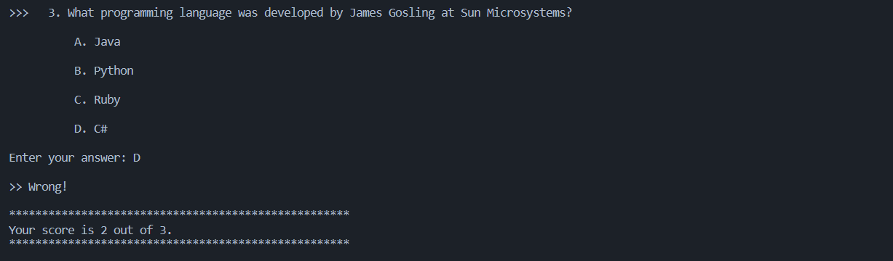

# Quiz Game in C
This is a simple quiz game program written in C. It prompts the user with multiple-choice questions, and allows the user to select an answer. After all questions have been answered, the program displays the number of correct answers.

## How to Run
To run the program, you will need a C compiler installed on your system. If you do not have one installed, you can download one from the internet, such as GCC. Once you have a compiler installed, you can run the program by compiling and executing the source code file quiz.c.

## How to Play
When the program starts, it will display a welcome message and a series of questions, each with four possible answers. To select an answer, simply enter the letter of the answer (A, B, C, or D) at the prompt. After all questions have been answered, the program will display your score.

## Game Output Screenshots

